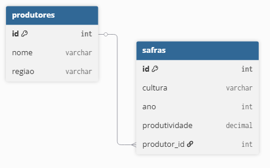

# Crop Production SQL Analysis

SQL database project focused on agricultural productivity monitoring and crop analysis.

---

## Project Overview

This project simulates a relational database environment designed for agricultural production monitoring, harvest tracking, and productivity analysis.

The objective is to demonstrate practical SQL, relational database modeling, and analytical querying skills applied to agribusiness scenarios.

---

## Technologies Used

* SQL
* PostgreSQL
* Relational Database Modeling
* Data Analysis

---

## Features

* Agricultural production monitoring
* Crop productivity analysis
* Harvest tracking queries
* Relational database structure
* SQL analytical queries

---

## Database Diagram



---

## Project Structure

```txt id="jlwmn5"
sql/
data/
docs/
images/
```

---

## Learning Goals

* Practice SQL queries
* Improve relational database modeling
* Simulate real-world agricultural datasets
* Develop analytical thinking for Data Analytics projects

---

## Author

Renato Andrade

AI Automation • SQL • Power BI • Data Analytics

